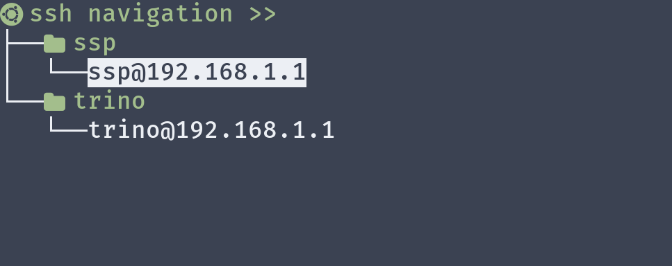

# SSH GUI

## Who i am

support ssh with up/down (j/k) then enter


## How to download

On gateway paste (download shell gui code)

**Stable version (only tree)**

```bash
wget https://github.com/ngoctd314/shell-gui/blob/master/dashboard?raw=true && mv dashboard\?raw\=true shtree && chmod +x shtree
```

**Develop version (has bug, includes tree, bar, shell)**


Create ssh folder navigation
```bash
cd
mkdir ssh_nav # or any name you want
```

Then create your command (tree style)
```txt
├── ssh_nav
│   ├── ssp
│   │   └── ssh ssp@192.168.1.1 -p2395
│   └── trino
│       └── echo Hello World
```

Run
```bash
cd
./shtree # in case you create ssh_nav dir
./shtree -dir=custom # in case you create custom dir
```